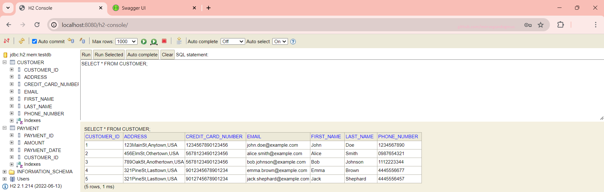
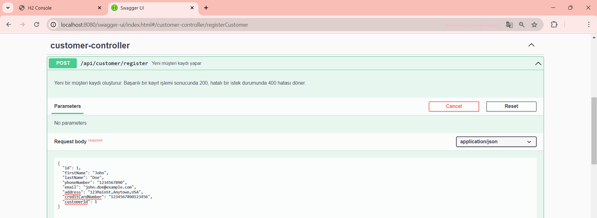
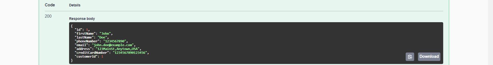
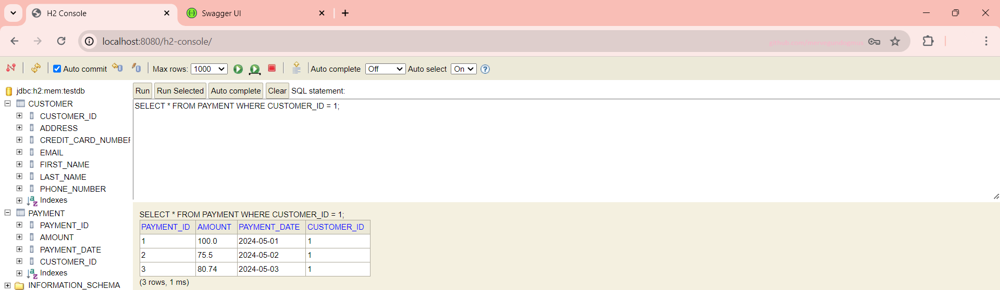
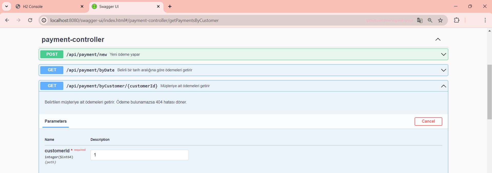
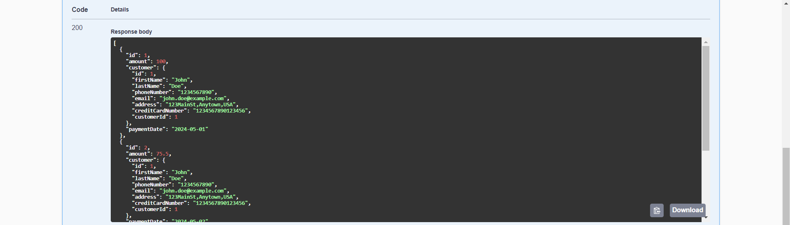

## Tech Stack: 
- Java 17
- Spring Boot 3.1.12
- Open API specification: Swagger 2.1.0
- H2 Database
- Swagger URL: http://localhost:8080/swagger-ui/index.html
- H2 Console URL: http://localhost:8080/h2-console/
- 
## Sample Inputs

| CUSTOMER_ID | ADDRESS                  | CREDIT_CARD_NUMBER | EMAIL                   | FIRST_NAME | LAST_NAME | PHONE_NUMBER |
|:------------|:------------------------:|-------------------:|------------------------:|-----------:|----------:|-------------:|
| 1           | 123MainSt,Anytown,USA    | 1234567890123456   | john.doe@example.com    | John       | Doe       | 1234567890   |
| 2           | 456ElmSt,Othertown,USA   | 5678123490123456   | alice.smith@example.com | Alice      | Smith     | 0987654321   |
| 3           | 789OakSt,Anothertown,USA | 5578123470123456   | bob.johnson@example.com | Bob        | Johnson   | 1112223344   |
| 4           | 321PineSt,Lasttown,USA   | 9012345678901234   | emma.brown@example.com  | Emma       | Brown     | 4445556677   |

## Customer Controller
#### H2 Database Page
- Sample SQL Query: SELECT * FROM CUSTOMER;
- List all customer and register new customers

#### Swagger UI Page

## Payment Controller
#### H2 Database Page
- Sample SQL Query: SELECT * FROM PAYMENT WHERE CUSTOMER_ID = 1;
- List all payments by customer ID
  

#### Swagger UI Page

