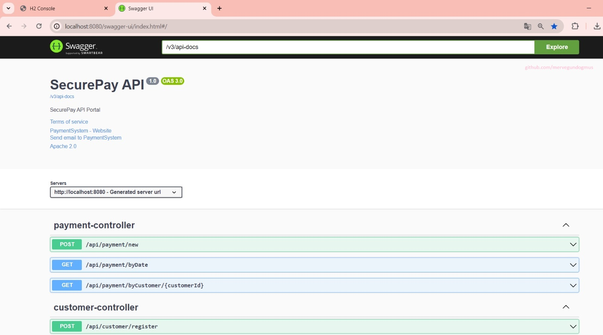
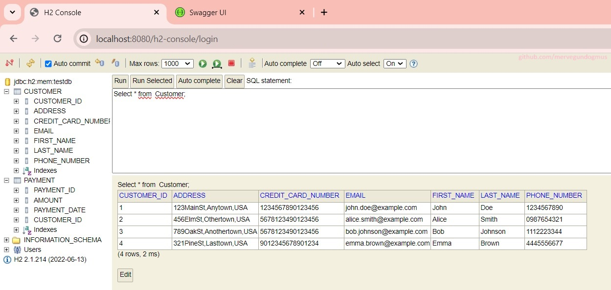

## Tech Stack: 
- Java 17
- Spring Boot 3.1.12
- Open API specification: Swagger 2.1.0
- H2 Database

### Swagger Page URL
http://localhost:8080/swagger-ui/index.html

### H2 Console Page URL
http://localhost:8080/h2-console/

### Payment Controller
#### H2 Database Page
- Sample SQL Query: SELECT * FROM PAYMENT WHERE CUSTOMER_ID = 1;
- List all payments by customer number

#### Swagger UI Page

